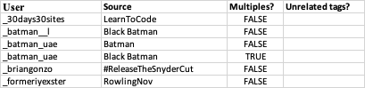

# User Checking

Even though the API is gone (but also maybe not fully gone) there are still ways to get data from Twitter. It's still a public website that we can browse to. So if we have a list of usernames we can check if they exist, if they're deleted, or if they're suspended.

Aaaaannddd, we may be able to automate this checking

- selenium - a python library to interact with a browser
- chrome - a web browser, but we'll run it in a headless mode (so nothing appears onscreen)


The script works by visiting the Web page for specified Twitter users, and looking at the page content to assess the account status. For example, if it finds the phrase "Twitter suspends accounts that violate the Twitter Rules." - it likely means that the account is suspend.

This _does_ mean that there is a possibility for false positives, because if an active account posts a tweet containing the search terms, it will get flagged accordingly. So things should be double checked, but this is great for working with large numbers at scale. I have included the '`</span>`' in the search phrases to try and only grab the correct markers

## Installation:


Install selenium with pip:

```
pip3 install selenium
```

You will need the Chrome Driver for selenium. You can download it from https://chromedriver.chromium.org/downloads
Be sure to add the executable to your `PATH` - on macOS I did this by copying the binary to `/usr/local/bin/chromedriver`

## Usage

Set the input and output file locations at the top of the script


The script expects to read from a CSV file where the twitter usernames are stored in the 1st column:

e.g.: 




Note that the usernames should be listed with _only_ the username, and nothing else. (no @, or twitter.com prefixes)